## История возникновения компьютерных сетей. Классификация сетей по размеру

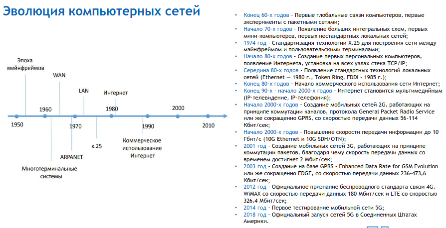
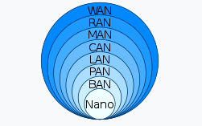

## Топологии сетей

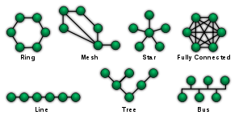

## Принципы коммутации. Основные стандартизирующие организации

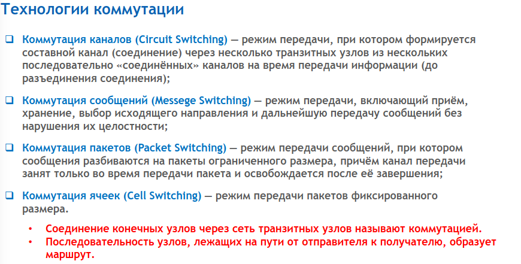

- ISO --- International Organization for Standardization,
- ISOC --- Internet Society
- IEEE --- Institute of Electrical and Electronic Engineers
- W3C --- World Wide Web Consortium

## Понятие протокола и интерфейса. Эталонная модель взаимодействия открытых систем

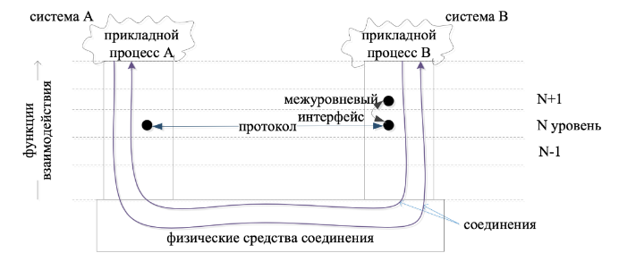
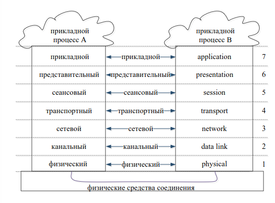

## Среда передачи данных. Типы, преимущества и недостатки

Средой передачи информации называются те линии связи,
по которым производится обмен информацией между абонентами.

- сетевой кабель:
  - коаксиальный кабель --- полоса пропускания до 1ГГц. Скорости до 10МБ/сек,
    расстояние передачи – 100-500м.;
  - витая пара --- Полоса пропускания 250-1000МГц,
    расстояние передачи до 100м, скорость от 10Мбит/с до 40ГБит/С.;
  - оптоволоконный кабель --- Передается не электрический сигнал, а световой импульс.
    Широкая полоса пропускания (до 1000ГГц), высокая скорость (до терабит в сек.)
    и расстояние передачи (тысячи км).;
- беспроводная связь
  - Радиоканал --- наиболее распространенный канал беспроводной связи.
  - Иногда используют инфракрасный канал. Главное его преимущество по
    сравнению с радиоканалом – нечувствительность к электромагнитным помехам.

## Понятие модуляции сигнала. Коды модуляции

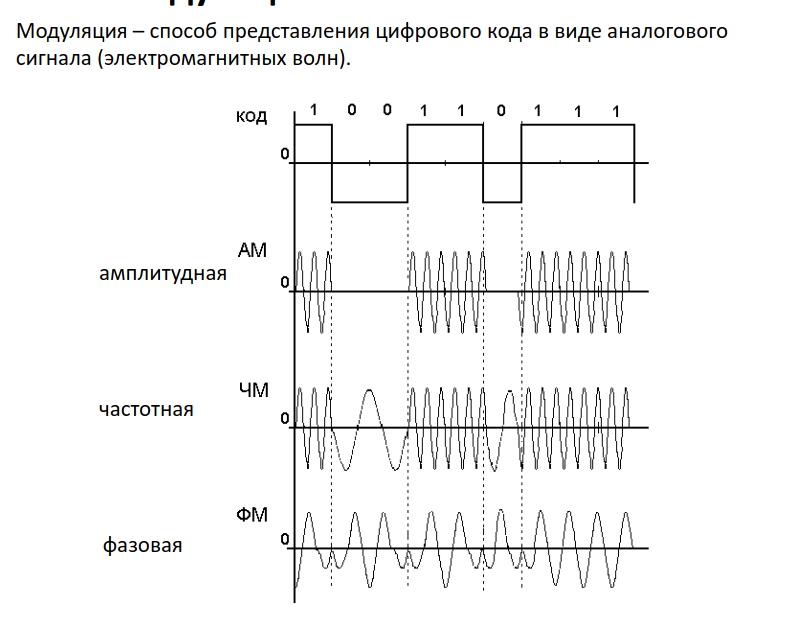
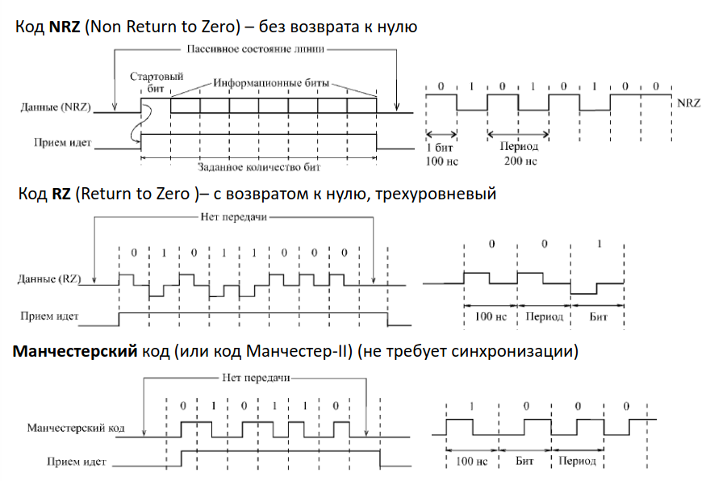

## Основные сетевые устройства

- сетевые адаптеры --- сопряжение компьютера с сетью;
- репитеры --- восстанавливают ослабленные сигналы, приводя их к исходному виду;
- концентраторы (хабы) --- объединения в общую сеть нескольких сегментов.
  Любой пришедший пакет передается всем подключенным к концентратору устройствам;
- коммутаторы (свичи) --- как и концентраторы, служат для соединения сегментов в сеть,
  но выполняют более сложные функции, производя сортировку поступающих на них пакетов;
- мосты --- устройства, служащие для объединения сетей;
- маршрутизаторы (роутеры) --- осуществляют выбор оптимального маршрута для
  каждого пакета для снижения нагрузки на сеть и обхода поврежденных участков;
- шлюзы --- это устройство для соединения сетей с отличающимися протоколами/стандартами обмена,
  например, для соединения локальных сетей с большими компьютерами или с глобальными сетями

## Основные стандарты проводных и беспроводных сетей

| Number        | Name                 |
| ------------- | -------------------- |
| IEEE 802.3    | Ethernet             |
| IEEE 802.4    | Token bus            |
| IEEE 802.5    | Token Ring Mac layer |
| IEEE 802.11   | WLAN/Wi-Fi           |
| IEEE 802.15   | Wireless PAN         |
| IEEE 802.15.1 | Bluetooth            |

## Системы 2G/2.5G/2.75G. Архитектура и принципы надстройки GPRS.

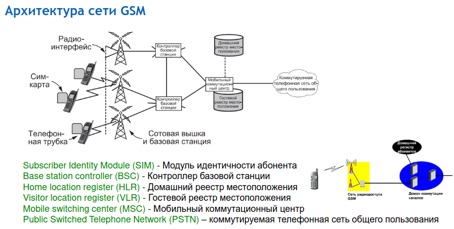

### GPRS (2.5G)

- General Packet Radio Service (GPRS) -- "пакетная радиосвязь общего пользования" -- надстройка над технологией мобильной связи GSM, осуществляющая пакетную передачу данных.
- GPRS позволяет пользователю сети сотовой связи производить обмен данными с другими устройствами в сети GSM и с внешними сетями, в том числе Интернет.
- Скорость передачи данных не более 170 Кбит/с.
- Данный стандарт применялся для:
  - Спутникового отслеживания транспорта.
  - Мобильный и в свою очередь безопасный доступ для сотрудников к корпоративным сетям, почтовым и информационным серверам предприятий.
  - Доступ в интернет с мобильного устройства с приемлемой на то время скоростью передачи данных, а также с тарификацией по переданным/полученным данным.

### EDGE (2.75G)

- EDGE (EGPRS) (Enhanced Data rates for GSM Evolution) -- цифровая технология беспроводной передачи данных для мобильной связи, которая функционирует как надстройка над 2G и 2.5G (GPRS)-сетями.
- Предусматривала введение новой схемы модуляции 8-PSK.
- В результате стала достижима скорость в 384 кбит/с.
- EDGE была введена в сетях GSM с 2003 фирмой Cingular (ныне AT&T) в США.

## История возникновения систем 3G. Основные элементы архитектуры сети.

В 1992 году международный союз телекоммуникаций (ITU) предпринял первую
попытку специфицировать систему третьего поколения 3G и выпустил проект
под названием IMT-2000, где IMT означало "Международная мобильная связь"
(International Mobile Telecommunications).

2000 означает:

- Год введения в эксплуатацию;
- Диапазон частот (в МГц) для работы системы;
- Пропускная способность (в Кбит/с).

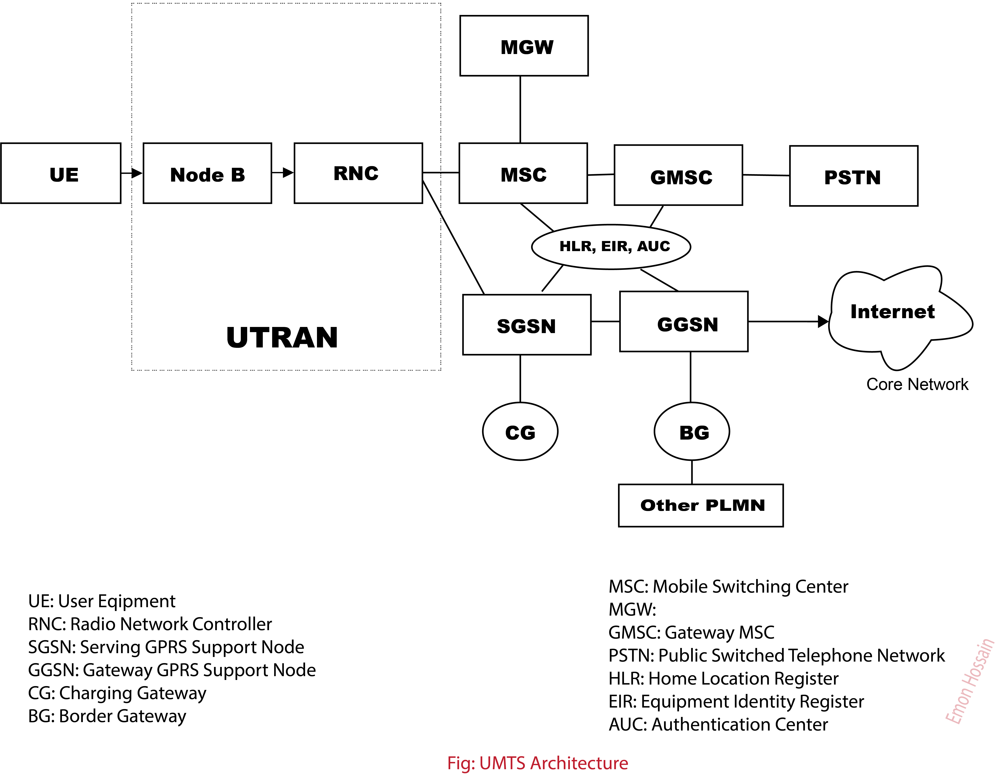

## Системы 3.5G 3.75G. Стандарты связи HSPA/HSPA+. Сравнение с системами 2G

### HSPA (3.5G)

Стандарт HSPA вышел в 2006 г. и объединяет две технологии:

- HSDPA - High Speed Downlink Packet Access (передача данных от базовой станции к
  абоненту): макс. скорость до 14,4 Мбит/с.
- HSUPA - High-Speed Uplink Packet Access (передача данных от абонента к базовой
  станции): макс. скорость до 5,76 Мбит/с.

### HSPA+

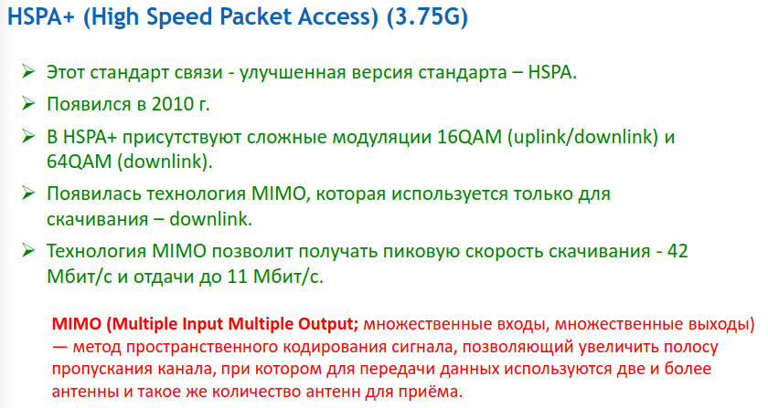

## Архитектура 4G LTE: основные элементы, реализация радиоинтерфейса, голосовые сервисы

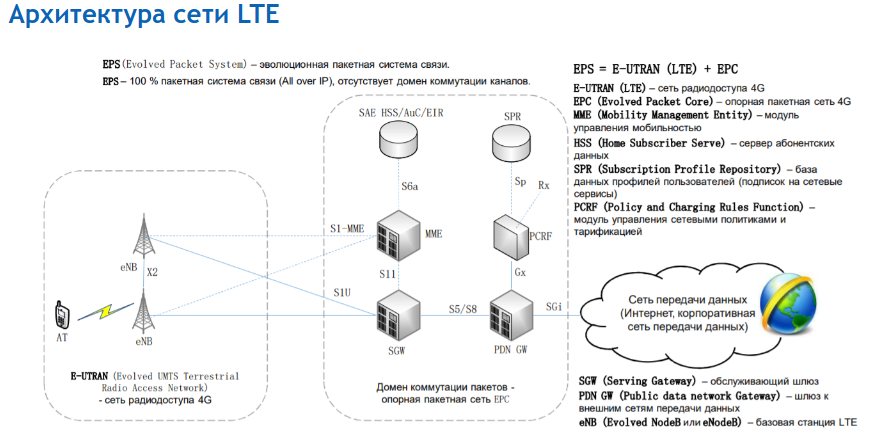
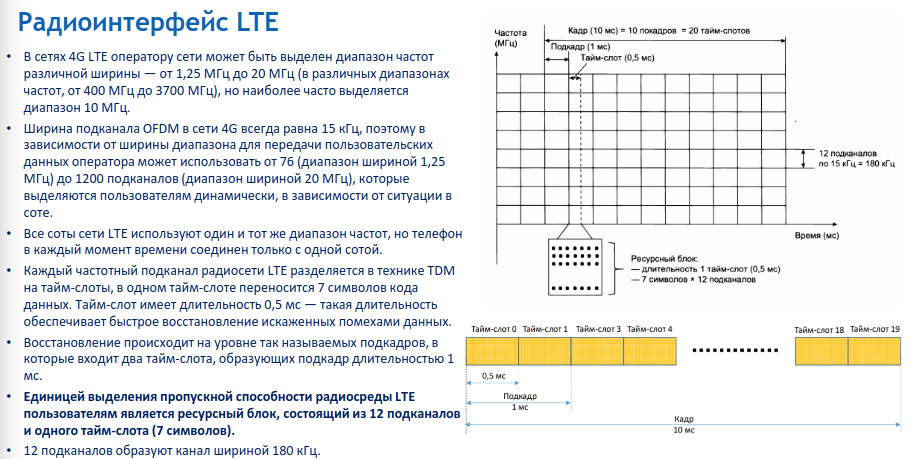
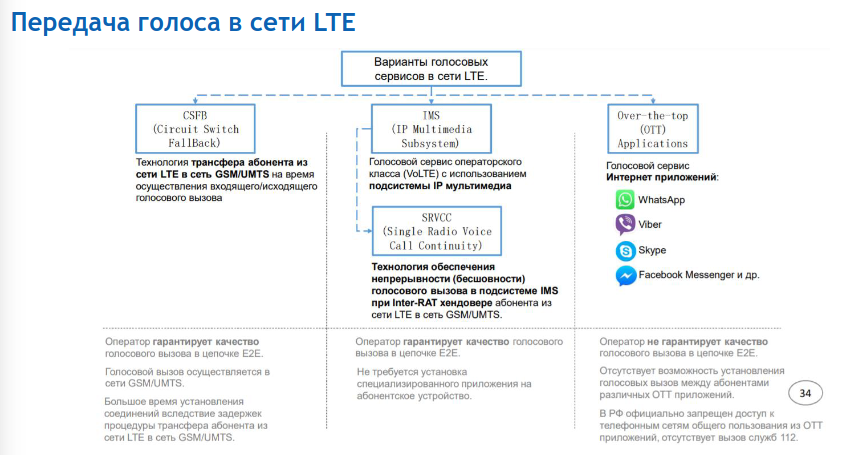

## Концепция сетей 5G. Характеристики качества обслуживания, используемые технологии

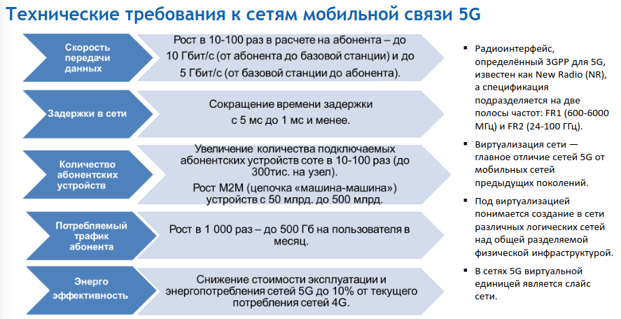
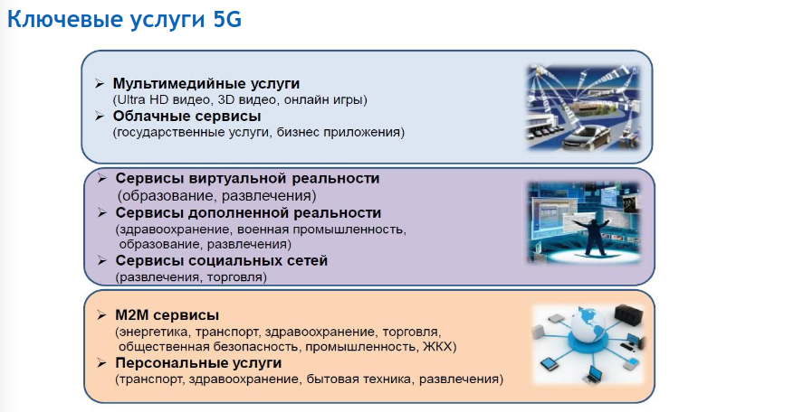

## Архитектура SDN и NFV. Отличия от традиционных сетей. Понятие MANO

### Software Defined Networking (SDN) :

SDN is a networking architecture which aims to improve overall network performance and make networks agile and flexible by enabling a dynamic and programmatically efficient network configuration. SDN is a technology that separates control plane management of network devices from underlying data plane that forwards network traffic in order to enable more automated provisioning and policy-based management of network resources.

Basically, SDN makes network programmable by separating system that is going to decide that where should traffic be sent i.e., control plane from underlying system that pushes packets of data to a particular destinations i.e., data plane. SDN offer its users a way to managed network services with help of software that makes networks centrally programmable, and allowing it for faster configuration. Software Defined Networking enables enterprises and service providers to respond quickly if business needs and requirements are changing which ultimately improves network control.

### Network Functions Virtualization (NFV) :

NFV is a network architecture which aims to accelerate service deployment for network operators and reduce cost by separating functions like firewall or encryption from dedicated hardware and moving them to virtual servers, collapsing various functions into a physical server, which ultimately reduces overall cost. NFV allows various network operators to implement network policy without being taken care of where to place functions in network and how to route traffic through these functions.

It is a way to virtualize network services, such as routers, firewalls, and load balances, that have traditionally been run on computer hardware whose interface is controlled by proprietor (proprietary hardware) and allows network services to be hosted on virtual machines. Virtual machines have a hypervisor, called a virtual machine manager, by which multiple operating systems can share a single hardware processor. It will deliver high-performance networks which have greater scalability, elasticity, and adaptability at low costs as compared to those networks which are built from traditional networking equipment. So it comes to overcome drawback of traditional, custom-designed network equipment and reduces need for dedicated or proprietary hardware to deploy and manage networks.

## Концепция сетей 6G. Основные требования и характеристики предоставляемых услуг. Проблемы реализации.

6G networks are expected to be more diverse than their predecessors
and are likely to support applications beyond current mobile use scenarios,
such as ubiquitous instant communications, pervasive intelligence and the Internet of Things (IoT).
It is expected that mobile network operators will adopt flexible decentralized business models for 6G,
with local spectrum licensing, spectrum sharing, infrastructure sharing,
and intelligent automated management underpinned by mobile edge computing,
artificial intelligence (AI), short-packet communication and blockchain technologies.

As of 2023, there is no universally-accepted government or non-government standard for what qualifies as 6G technology and it is still in the early stage of development.
