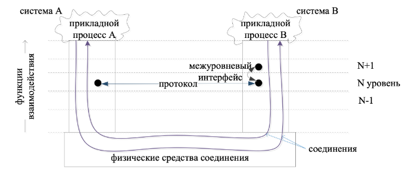
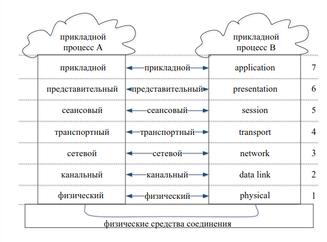
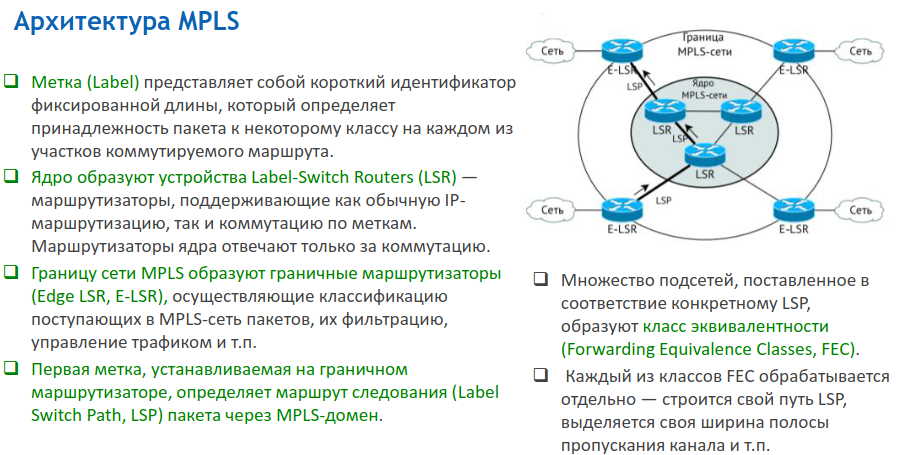
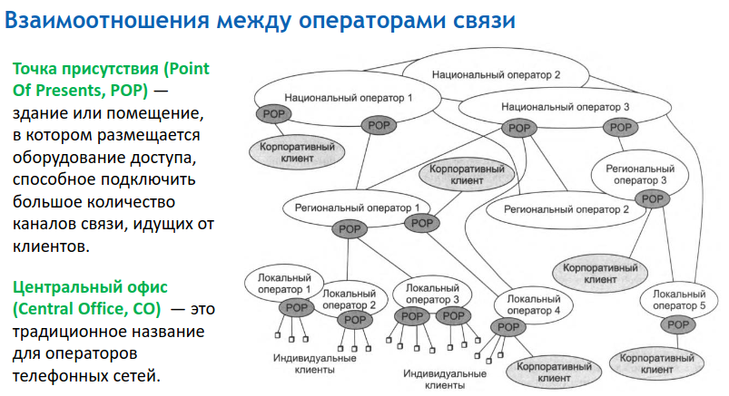
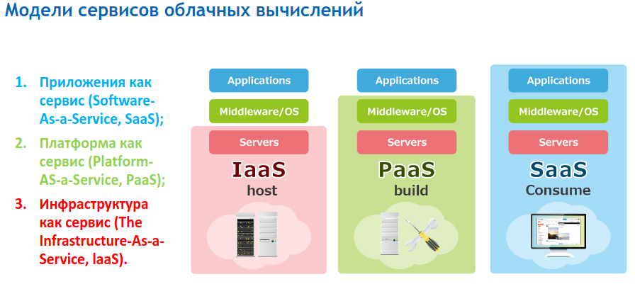
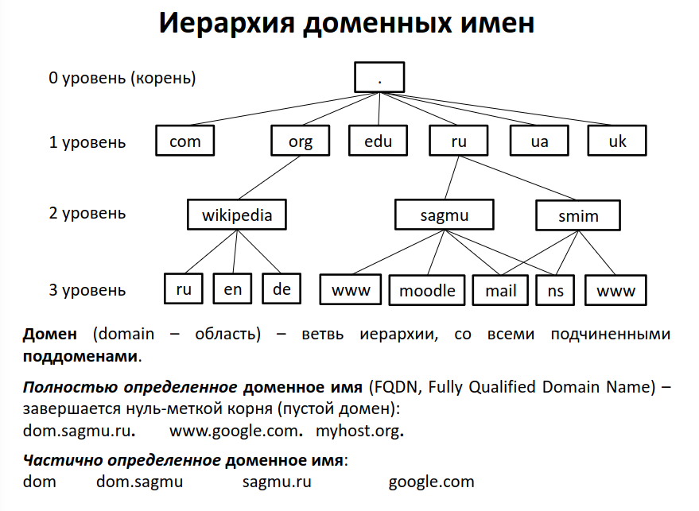
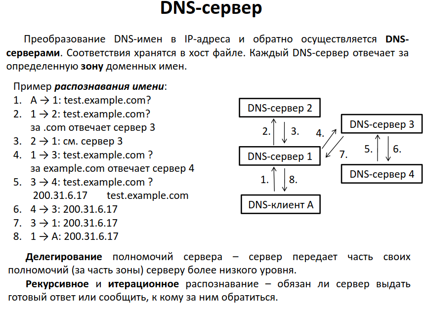
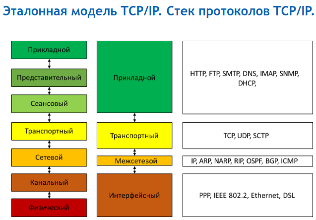
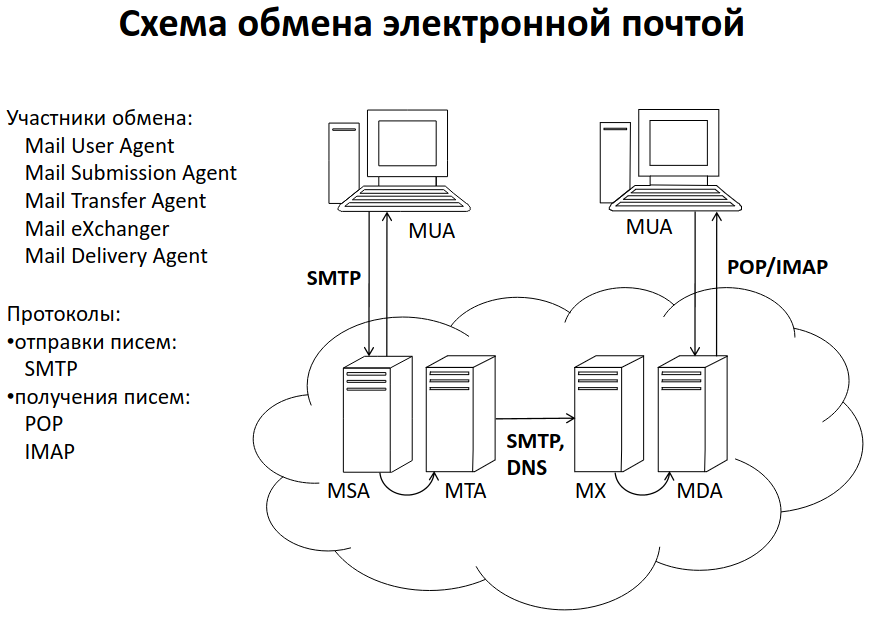

## История возникновения компьютерных сетей. Классификация сетей по размеру

## Топологии сетей

## Принципы коммутации. Основные стандартизирующие организации

- ISO --- International Organization for Standardization,
- ISOC --- Internet Society
- IEEE --- Institute of Electrical and Electronic Engineers
- W3C --- World Wide Web Consortium

## Понятние протокола и интерфейса. Эталонная модель взаимодействия открытых систем

## Среда передачи данных. Типы, преимущества и недостатки

Средой передачи информации называются те линии связи,
по которым производится обмен информацией между абонентами.

- сетевой кабель:
  - коаксиальный кабель --- полоса пропускания до 1ГГц. Скорости до 10МБ/сек,
    расстояние передачи – 100-500м.;
  - витая пара --- Полоса пропускания 250-1000МГц,
    расстояние передачи до 100м, скорость от 10Мбит/с до 40ГБит/С.;
  - оптоволоконный кабель --- Передается не электрический сигнал, а световой импульс.
    Широкая полоса пропускания (до 1000ГГц), высокая скорость (до терабит в сек.)
    и расстояние передачи (тысячи км).;
- беспроводная связь
  - Радиоканал --- наиболее распространенный канал беспроводной связи.
  - Иногда используют инфракрасный канал. Главное его преимущество по
    сравнению с радиоканалом – нечувствительность к электромагнитным помехам.

## Понятие модуляции сигнала. Коды модуляции

## Основные сетевые устройства

- сетевые адаптеры --- сопряжение компьютера с сетью;
- репитеры --- восстанавливают ослабленные сигналы, приводя их к исходному виду;
- концентраторы (хабы) --- объединения в общую сеть нескольких сегментов.
  Любой пришедший пакет передается всем подключенным к концентратору устройствам;
- коммутаторы (свичи) --- как и концентраторы, служат для соединения сегментов в сеть,
  но выполняют более сложные функции, производя сортировку поступающих на них пакетов;
- мосты --- устройства, служащие для объединения сетей;
- маршрутизаторы (роутеры) --- осуществляют выбор оптимального маршрута для
  каждого пакета для снижения нагрузки на сеть и обхода поврежденных участков;
- шлюзы --- это устройство для соединения сетей с отличающимися протоколами/стандартами обмена,
  например, для соединения локальных сетей с большими компьютерами или с глобальными сетями

## Основные стандарты проводных и беспроводных сетей

| Number        | Name                 |
| ------------- | -------------------- |
| IEEE 802.3    | Ethernet             |
| IEEE 802.4    | Token bus            |
| IEEE 802.5    | Token Ring Mac layer |
| IEEE 802.11   | WLAN/Wi-Fi           |
| IEEE 802.15   | Wireless PAN         |
| IEEE 802.15.1 | Bluetooth            |

## Архитектура и принципы MPLS-сетей

- Технология коммутации пакетов по меткам в многопротокольных сетях
  (Multiprotocol Label Switching, MPLS) --- механизм передачи данных, который
  эмулирует различные свойства сетей с коммутацией каналов поверх сетей с
  коммутацией пакетов.  
  

## Технологии доступа с виртуальными каналами

### X.25

Стандарт Х.25 описывает способы обмена информацией между удалёнными терминалами,
локальными сетями и другими видами конечного оборудования.

Стандарт предполагает обмен данными при помощи коммутации пакетов с установлением
виртуальных соединений.

#### Достоинства:

- В режиме реального времени есть возможность разделять один и тот же
  физический канал между несколькими абонентами,
- Передача данных может осуществляется по каналам телефонной сети
  общего пользования (выделенным и коммутируемым) оптимальным
  образом, т.е. с максимально возможной на указанных каналах скоростью и
  достоверностью передачи данных,
- Возможно применение механизма альтернативной маршрутизации.

#### Недостатки:

- Невозможность передавать такие виды информации, как голос и видео.

### Frame Relay

Frame Relay (FR) --- ретрансляция кадров --- технология доставки сообщений

В сети Frame Relay используется два типа виртуальных каналов:
коммутируемые (Switched Virtual Circuits, SVC);
постоянные (Permanent Virtual Circuits, PVC).

#### Достоинства:

- малое время задержки;
- простой формат кадров, содержащих минимум управляющей информации, следствием
  чего является высокая эффективность передачи данных;
- независимость от протоколов верхних уровней модели ISO/OSI;
- предсказуемая пропускная способность;
- возможность контроля работоспособности (нагруженности) канала;
- возможность приоритезации разнородного трафика (для каждого типа трафика можно
  организовать своё виртуальное соединение).

#### Недостатки:

- Frame Relay не различает протоколы вышележащих уровней и, следовательно, нельзя
  приоритезировать трафик без организации дополнительных виртуальных соединений, что
  несёт дополнительные накладные расходы;
- отсутствие широковещательного множественного доступа;
- нет встроенных функций контроля доставки и управления потоком кадров.

## Сети операторов связи. Концепция облачных вычислений

### Cloud computing

Облачные вычисления (cloud computing) --- концепция в соответствии с которой
компьютер, который выполняет программу пользователя, находится где-то в "облаке"
вычислительных ресурсов --- процессоров, оперативной памяти, дисковых накопителей.

Свойства:

- Качественно новый уровень разделения ресурсов;
- Высокая степень масштабируемости;
- Эластичность;
- Гибкость оплаты использованных ресурсов;
- Самостоятельное выделение ресурсов.

## Принципы работы DNS

## Принципы работы DHCP

## URL. Структура, ограничения и правила.

Uniform Resource Locator --- единообразный локатор (определитель местонахождения) ресурса.
Это основной способ определения расположения ресурсов в WWW.
`<схема>://<логин>:<пароль>@<хост>:<порт>/<путь>?<параметры>#<якорь>`

- `схема` схема обращения к ресурсу (обычно сетевой протокол – http, ftp, mailto, file)
- `хост` полное имя хоста в системе DNS или IP-адрес в десятичной форме
- `путь` уточняющая информация о месте нахождения ресурса (зависит от протокола, обычно путь к файлу на сервере) `параметры` строка запроса с передаваемыми на сервер параметрами
  (разделитель - знак `&`) `?параметр_1=значение_1&параметр_2=значение_2&параметр3=значение_3`
- `якорь` позволяет ссылаться на некоторую часть (раздел) открываемого документа
  (в HTML задается тэгом `<a name="имя-якоря">`

  В URL разрешено использовать лишь ограниченный набор ASCII-символов:
  латинские буквы, цифры и некоторые знаки препинания.
  Недопустимые символы представляются в виде "percent‐encoding": знак `%` и
  шестнадцатеричный код (2 hex-символа = 1 байт).
  Символы нелатинского алфавита представляются в кодировке Юникод (UTF-8).
  Но в ней символы кодируются 2 байтами (4 hex-цифры).
  Адрес одной и той же страницы может быть представлен разными URL. Для
  однозначности веб-серверы, а также поисковые системы преобразуют URL к
  нормальному (каноническому) виду.

## Протоколы стека TCP/IP.

## Методы и запросы в НТТР

| Method    | Description                                                                                                                   |
| --------- | ----------------------------------------------------------------------------------------------------------------------------- |
| `GET`     | The `GET` method requests a representation of the specified resource. Requests using GET should only retrieve data.           |
| `HEAD`    | The `HEAD` method asks for a response identical to a GET request, but without the response body.                              |
| `POST`    | The `POST` method submits an entity to the specified resource, often causing a change in state or side effects on the server. |
| `PUT`     | The `PUT` method replaces all current representations of the target resource with the request payload.                        |
| `DELETE`  | The `DELETE` method deletes the specified resource.                                                                           |
| `CONNECT` | The `CONNECT` method establishes a tunnel to the server identified by the target resource.                                    |
| `OPTIONS` | The `OPTIONS` method describes the communication options for the target resource.                                             |
| `TRACE`   | The `TRACE` method performs a message loop-back test along the path to the target resource.                                   |
| `PATCH`   | The `PATCH` method applies partial modifications to a resource.                                                               |

## Протоколы электронной почты

### SMTP

Simple Mail Transfer Protocol --- простой протокол передачи текстовых
сообщений. Предназначен для передачи исходящей почты с использованием TCP.
SMTP --- требующий соединения текстовый протокол, по которому
отправитель сообщения связывается с получателем посредством выдачи
командных строк и получения необходимых данных через надёжный канал (TCP-соединение).
SMTP-сессия состоит из команд, посылаемых SMTP-клиентом, и
соответствующих ответов SMTP-сервера.
Сессия может включать >=0 SMTP-операций (транзакций).
Письмо включает:

- конверт (заголовок),
- содержание письма (тело).

Процесс передачи почтовых сообщений осуществляется в три фазы:

1. установление соединения
2. передача почты
3. завершение соединения

### POP3

Post Office Protocol Version 3 --- стандартный Интернет-протокол прикладного
уровня, используемый для извлечения электронного сообщения с удаленного
сервера по TCP/IP-соединению.
POP поддерживает простые требования "загрузи-и-удали" для доступа к удаленным почтовым ящикам.

В протоколе POP3 предусмотрено 3 состояния сеанса:

- **Авторизация**
  Клиент проходит процедуру аутентификации.
- **Транзакция**
  Клиент получает информацию о состоянии почтового ящика, принимает и удаляет почту.
- **Обновление**
  Сервер удаляет выбранные письма и закрывает соединение

### IMAP

Internet Message Access Protocol --- протокол прикладного уровня для доступа к
электронной почте.
Базируется на транспортном протоколе TCP.
Текущая версия IMAP4.1

### Основные отличия POP3 и IMAP

- При использовании POP3 клиент подключается к серверу только на
  промежуток времени, необходимый для загрузки новых сообщений. При
  использовании IMAP соединение не разрывается, пока пользовательский
  интерфейс активен, а сообщения загружаются только по требованию клиента. Это
  позволяет уменьшить время отклика для пользователей, в чьих ящиках имеется
  много сообщений большого объёма.
- Протокол POP требует, чтоб текущий клиент был единственным
  подключенным к ящику. IMAP позволяет одновременный доступ нескольких
  клиентов к ящику и предоставляет клиенту возможность отслеживать изменения,
  вносимые другими клиентами, подключенными одновременно с ним.
- Благодаря системе флагов, определенной в IMAP4, клиент может отслеживать
  состояние сообщения (прочитано, отправлен ответ, удалено и т. д.); данные о
  флагах хранятся на сервере.
- Клиенты IMAP4 могут создавать, переименовывать и удалять ящики и
  перемещать сообщения между ящиками.

## Протокол SIP

- SIP (Session Initiation Protocol --- протокол инициирования сеансов
  связи) --- протокол прикладного уровня, предназначенный для
  организации, модификации и завершения сеансов связи:
  мультимедийных конференций, телефонных соединений и
  распределения мультимедийной информации.

### Основные функции протокола:

- обнаружение конечного устройства;
- установление соединения с конечным устройством для;
  определения возможности инициировать сеанс связи;
- обеспечение передачи параметров будущего сеанса связи;
- модификация уже начавшегося сеанса связи;
- завершение сеансов связи.

### Дополнительные функции протокола:

- размещение и загрузка информации присутствия;
- обеспечение запроса на доставку информации по присутствию;
- уведомление о статусе присутствия или других событиях;
- доставка мгновенных сообщени.
