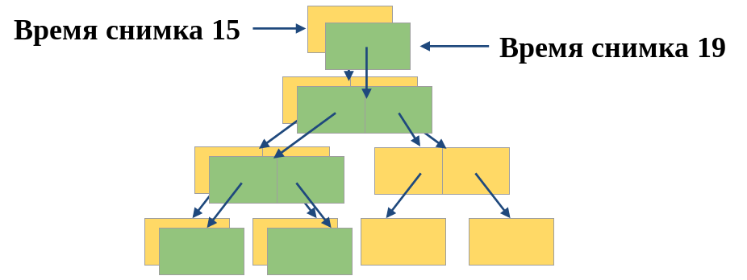

# Логические тома ZFS

Выполнил: Матюхин Григорий

---

## Что такое ZFS?

---

# Другие файловые системы

  
  
  

---

## Пулы хранения

---

## Целостность данных

---

# Самовосстановление

---

## Другие файловые системы

  
  
  

---

## ZFS

  
  
  

---

## RAID-Z

<table>
  <tr>
    <th>
      <!-- 
 -->
      <!--   Disk -->
      <!-- 
 -->
      <!-- 
 -->
      <!--   LBA -->
      <!-- 
 -->
    </th>
    <th>A</th>
    <th>B</th>
    <th>C</th>
    <th>D</th>
    <th>E</th>
  </tr>

  <tr>
    <th>0</th>
    <td style="background-color:orange">P0</td>
    <td style="background-color:orange">D0</td>
    <td style="background-color:orange">D2</td>
    <td style="background-color:orange">D4</td>
    <td style="background-color:orange">D6</td>
  </tr>

  <tr>
    <th>1</th>
    <td style="background-color:orange">P1</td>
    <td style="background-color:orange">D1</td>
    <td style="background-color:orange">D3</td>
    <td style="background-color:orange">D5</td>
    <td style="background-color:orange">D7</td>
  </tr>

  <tr>
    <th>2</th>
    <td style="background-color:yellow">P0</td>
    <td style="background-color:yellow">D0</td>
    <td style="background-color:yellow">D1</td>
    <td style="background-color:yellow">D2</td>
    <td style="background-color:green">P0</td>
  </tr>

  <tr>
    <th>3</th>
    <td style="background-color:green">D0</td>
    <td style="background-color:green">D1</td>
    <td style="background-color:green">D2</td>
    <td style="background-color:red">P0</td>
    <td style="background-color:red">D0</td>
  </tr>

</table>

---

## Копирование при записи

---

## Снимки и клоны

---

# Спасибо за внимание
