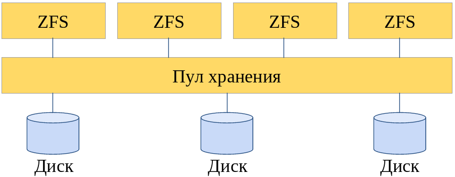
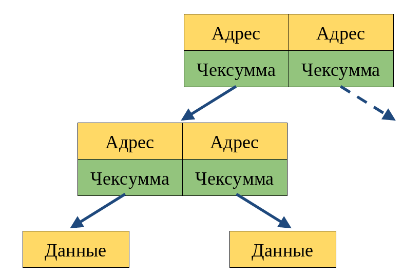
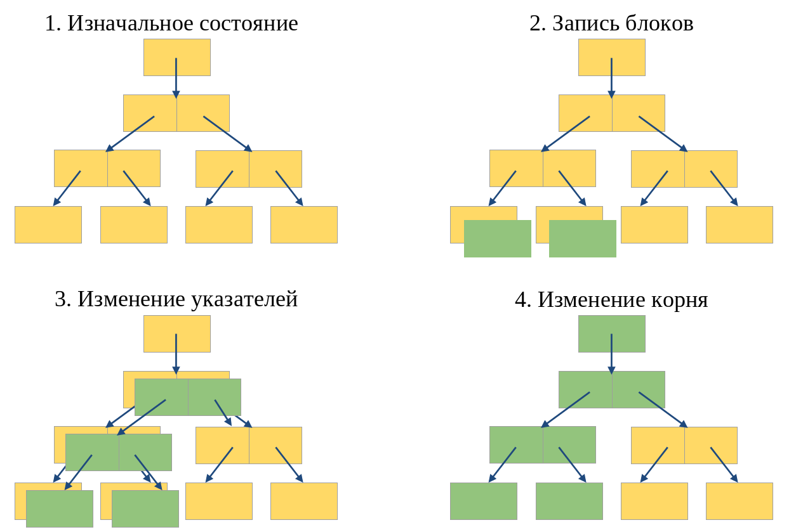
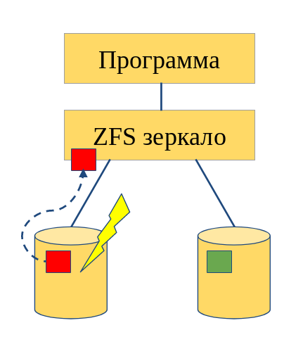

# Логические тома ZFS

Выполнил: Матюхин Григорий

---

## Что такое ZFS?

---

# Другие файловые системы

---

## Пулы хранения

---

## Целостность данных

---

## RAID-Z

---

## Копирование при записи

---

## Снимки и клоны

---

# Спасибо за внимание
